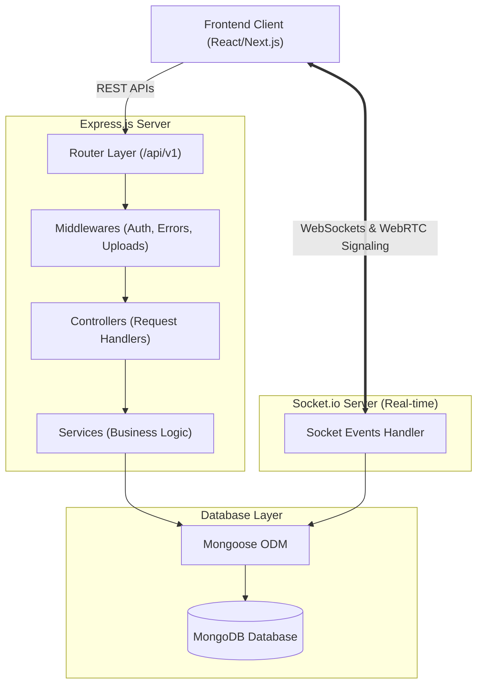
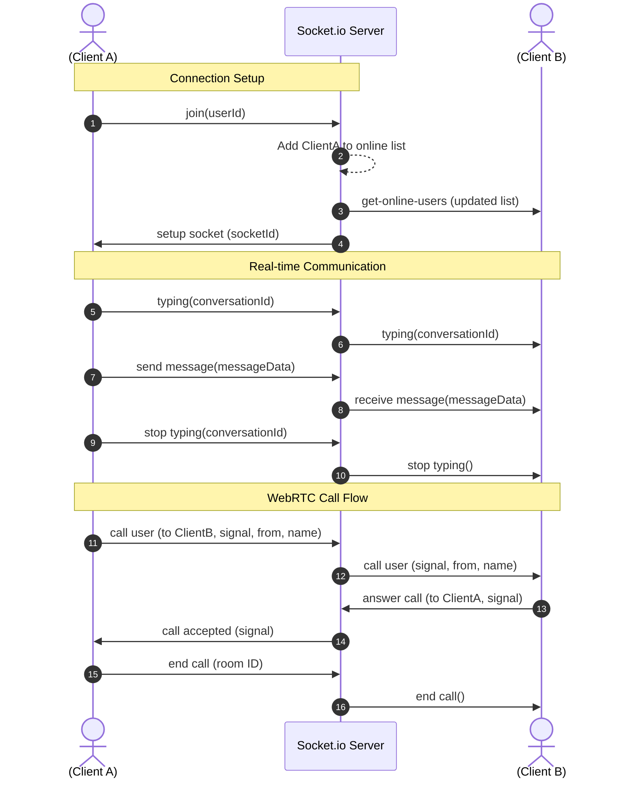
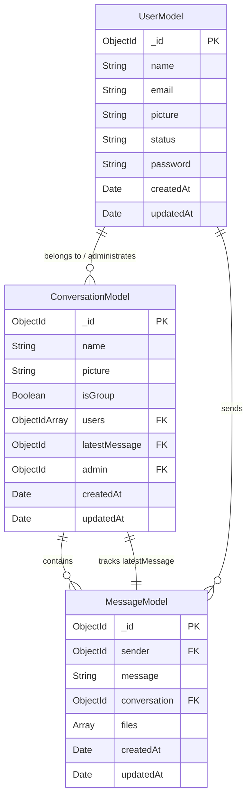

# WhatsApp Clone (Backend Server)

[](https://nodejs.org/)
[](https://expressjs.com/)
[](https://www.mongodb.com/)
[](https://socket.io/)

A robust, real-time backend engine powering a WhatsApp Web application. This server handles HTTP REST APIs for user management, authentication, conversations, and direct messaging, alongside WebRTC signaling and real-time event distribution (like typing indicators, online status, and live messaging) via Socket.io.

---

## System Architecture

The server adopts a clean MERN-stack backend architecture separating concerns into Routes, Controllers, Services, Models, and Middleware layers.



---

## Socket.io Real-time Event Flow

Real-time actions are managed through a centralized socket handler:



---

## Database Entity Relationship Diagram (ERD)

The application models its schema relationships as follows:



---

## Key Features

- **Secure Authentication**: JSON Web Tokens (JWT) for session management and token verification. Hashed password storage with `bcrypt`.
- **Real-Time Synchronization**: Instantly sync messages, active/offline status, and live typing indicators.
- **Audio/Video Signaling**: WebRTC handshake signaling facilitated over WebSockets for seamless peer-to-peer calling.
- **File & Media Uploads**: Safe handling of multi-media payloads (images, documents, audio) with native unique file suffix naming.
- **Production-Grade Protection**: Includes standard security filters such as cross-origin resource isolation (`helmet`), NoSQL injection prevention (`express-mongo-sanitize`), CORS restrictions, request trimming, and response compression.
- **Robust Logging**: Integrated logging suite powered by `winston` for error debugging and terminal information.

---

## API Endpoints

### Authentication Routes (`/api/v1/auth`)

| Method | Endpoint        | Description                                   | Protected |
| :----- | :-------------- | :-------------------------------------------- | :-------: |
| `POST` | `/register`     | Register a new user profile                   |    No     |
| `POST` | `/login`        | User authentication & retrieve tokens         |    No     |
| `POST` | `/logout`       | Invalidate current session tokens             |    No     |
| `POST` | `/refreshtoken` | Exchange expired token for a new active token |    No     |

### User Routes (`/api/v1/user`)

| Method | Endpoint        | Description                 | Protected |
| :----- | :-------------- | :-------------------------- | :-------: |
| `GET`  | `?search=query` | Find users by name or email |    Yes    |

### Conversation Routes (`/api/v1/conversation`)

| Method | Endpoint | Description                               | Protected |
| :----- | :------- | :---------------------------------------- | :-------: |
| `POST` | `/`      | Open direct message or create group       |    Yes    |
| `GET`  | `/`      | Fetch all conversations user is a part of |    Yes    |
| `POST` | `/group` | Create a new group chat room              |    Yes    |

### Message Routes (`/api/v1/message`)

| Method | Endpoint     | Description                                   | Protected |
| :----- | :----------- | :-------------------------------------------- | :-------: |
| `POST` | `/`          | Send a new message to a conversation          |    Yes    |
| `GET`  | `/:convo_id` | Fetch all message history for a specific room |    Yes    |

### Upload Routes (`/api/v1/upload`)

| Method | Endpoint | Description                 | Protected |
| :----- | :------- | :-------------------------- | :-------: |
| `POST` | `/`      | Upload a file / media asset |    Yes    |

---

## Environment Variables Setup

Create a `.env` file in the root directory and configure the variables accordingly:

```env
# Server settings
PORT=8000
NODE_ENV=development

# Database connection
DATABASE_URL=your_mongodb_connection_string
MONGO_URI=your_mongodb_connection_string

# Client URL (for CORS)
CLIENT_ENDPOINT=http://localhost:3000

# Security tokens
ACCESS_TOKEN_SECRET=your_jwt_access_secret_key
REFRESH_TOKEN_SECRET=your_jwt_refresh_secret_key
JWT_SECRET=your_jwt_secret_key
JWT_EXPIRES_IN=30d

# Media defaults
DEFAULT_STATUS="Hello there! I am using Whatsapp."
DEFAULT_PICTURE=https://res.cloudinary.com/example/default_pic.png
DEFAULT_GROUP_PICTURE=https://res.cloudinary.com/example/default_group_pic.png
```

---

## Getting Started

### Prerequisites

- NodeJS (v18 or higher recommended)
- Yarn or NPM
- MongoDB Atlas or a local MongoDB database

### Installation

1. **Clone the repository:**

   ```bash
   git clone https://github.com/your-username/whatsapp-clone-backend.git
   cd whatsapp-clone-backend
   ```

2. **Install all dependencies:**

   ```bash
   yarn install
   # or
   npm install
   ```

3. **Configure environment settings:**
   Rename `.env.example` to `.env` or create `.env` manually, using the key-value guidelines above.

4. **Start the server:**
   - **Development mode** (runs with nodemon):
     ```bash
     yarn dev
     # or
     npm run dev
     ```
   - **Production mode**:
     ```bash
     yarn start
     # or
     npm start
     ```

---

## Project Directory Structure

```text
whatsapp-clone-backend
├── public/                 # Static asset server directory
│   └── uploads/            # Files uploaded by clients
├── src/
│   ├── configs/            # Application settings (e.g. logger)
│   ├── controllers/        # Request handlers
│   ├── middlewares/        # Express custom middlewares (Auth, Errors)
│   ├── models/             # Mongoose schemas (User, Conversation, Message)
│   ├── routes/             # REST route routing
│   ├── services/           # Service-level query logic
│   ├── utils/              # Helper utility functions
│   ├── app.js              # Express configuration & setup
│   ├── index.js            # Main entry point (HTTP & Sockets)
│   └── SocketServer.js     # Real-time WebSocket connection engine
├── .env                    # Secrets & local config values
├── package.json            # Project dependencies and runs
└── README.md               # Documentation guide
```
